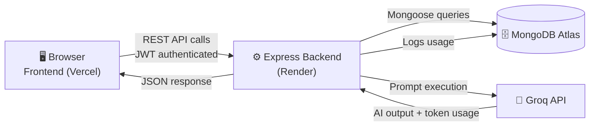
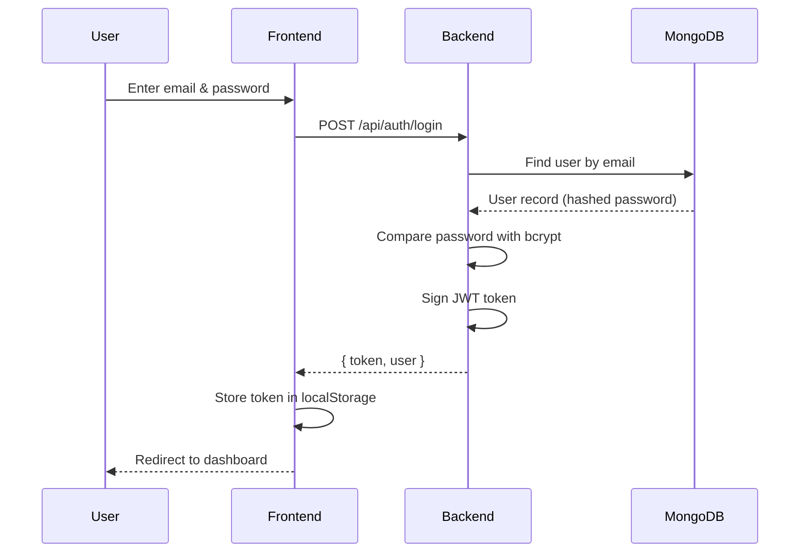
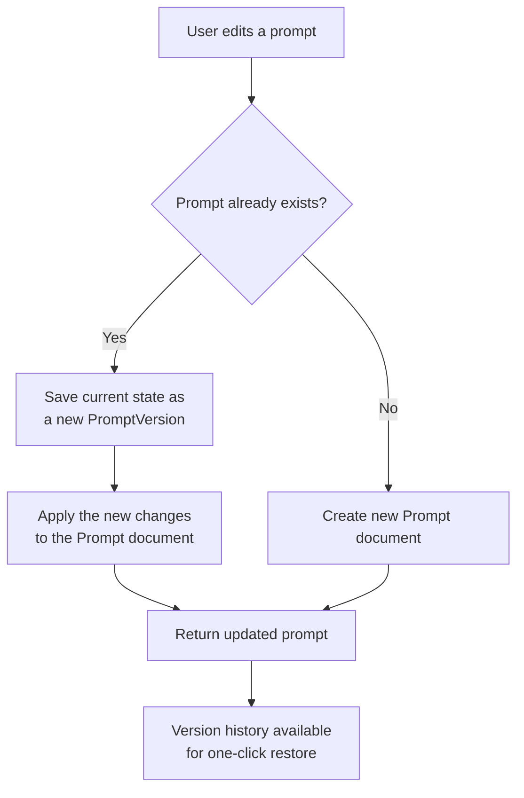
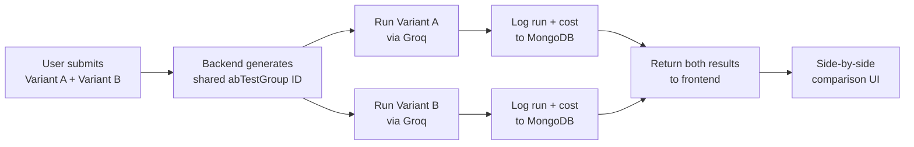
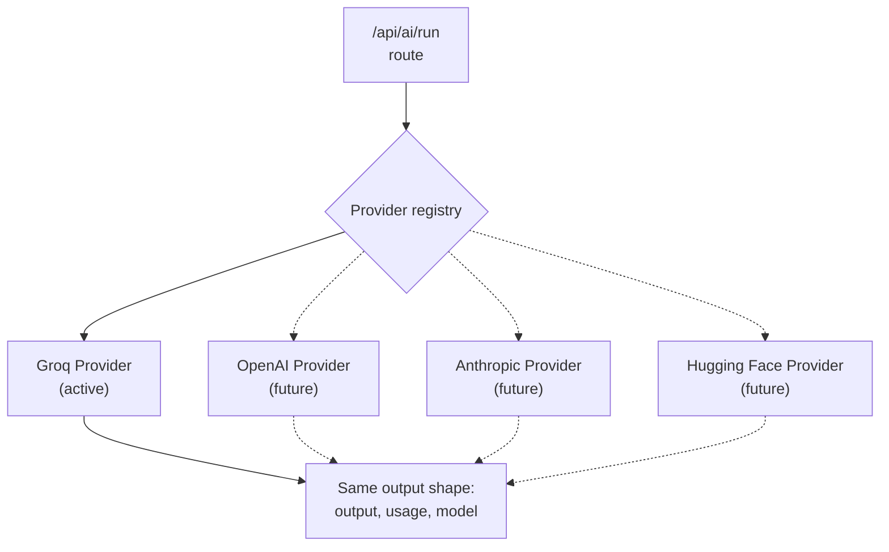

# ⚡ PromptSpark

**A full-stack SaaS platform to create, test, version, and analyze AI prompts.**

Build your prompt library, run prompts live against an AI model, A/B test variants, and track token cost — all in one clean, modern dashboard.

[Live Demo](#) · [API Documentation](./API_DOCS.md) · [Report a Bug](#)

<div align="center">

<br>

[](https://www.python.org/)
[](https://nodejs.org/)
[](https://expressjs.com/)
[](https://www.mongodb.com/atlas)
[](https://developer.mozilla.org/en-US/docs/Web/JavaScript)
[](https://developer.mozilla.org/en-US/docs/Web/HTML)
[](https://developer.mozilla.org/en-US/docs/Web/CSS)
[](https://getbootstrap.com/)
[](https://jwt.io/)
[](https://www.chartjs.org/)
[](https://groq.com/)
[](https://jestjs.io/)
[](https://render.com/)
[](https://vercel.com/)
[](https://git-scm.com/)
[](https://github.com/)
[](https://www.promptingguide.ai/)
</div>

---

## 📖 Overview

PromptSpark is a complete prompt-engineering workspace — the kind of internal tool an AI-focused team would actually use. It lets a user register, build a personal library of prompts, edit them with full version history, run them live against a large language model, compare two variants head-to-head, and track exactly how much every AI call costs.

---

## ✨ Features

| | Feature | Description |
|---|---|---|
| 🔐 | **Authentication** | Secure registration and login with JWT tokens and bcrypt password hashing |
| 📝 | **Prompt Library** | Full CRUD — create, edit, and delete prompts, organized by category |
| 🔍 | **Search & Filtering** | Live, debounced search by title plus category filtering |
| 🕒 | **Version Control** | Every edit auto-snapshots the previous version, with one-click restore |
| 🤖 | **AI Playground** | Run any prompt live against the Groq API and see the output instantly |
| ⚖️ | **A/B Testing** | Run two prompt variants in parallel and compare results side by side |
| 📊 | **Analytics Dashboard** | Visual charts of daily cost and token usage, powered by MongoDB aggregation |
| 💰 | **Cost Tracking** | Every AI call is logged with token counts and calculated cost in real time |
| 🛡️ | **Security Hardened** | Helmet, rate limiting, and input validation on every endpoint |
| ✅ | **Automated Testing** | Jest + Supertest test suite covering the authentication flow |
| 📱 | **Responsive UI** | Fully usable across desktop, tablet, and mobile |
| 📚 | **API Documentation** | A complete written reference of every backend endpoint |

---

## 🧰 Tech Stack

**Frontend** — HTML5, CSS3, JavaScript, Bootstrap, Chart.js
**Backend** — Node.js, Express.js
**Database** — MongoDB Atlas, Mongoose
**Authentication** — JWT, bcrypt.js
**AI Provider** — Groq API (built on a swappable provider architecture — OpenAI, Anthropic, and Hugging Face can be added as new provider files)
**Security** — Helmet, express-rate-limit, express-validator
**Testing** — Jest, Supertest, mongodb-memory-server
**Deployment** — Render (backend), Vercel (frontend), MongoDB Atlas (database)
**Version Control** — Git, GitHub

---

## 🏗️ System Architecture



## 🔑 Authentication Flow



## ✍️ Prompt Versioning Flow



## ⚖️ A/B Testing Flow



## 🧩 AI Provider Architecture



---

## 🚀 Getting Started

### Prerequisites
- Node.js and npm installed
- A MongoDB Atlas account (free tier works)
- A Groq API key from [console.groq.com](https://console.groq.com/keys)

### Installation

```bash
# Clone the repository
git clone https://github.com/Stars8575/PROMPTSPARK-CapstoneProject
cd promptspark

# Install backend dependencies
cd backend
npm install
```

Create a `.env` file inside `backend/`:

```
PORT=5000
MONGO_URI=your_mongodb_connection_string
JWT_SECRET=your_random_secret_key
GROQ_API_KEY=your_groq_api_key
```

### Run locally

```bash
# Start the backend
cd backend
npm run dev
```

Open `frontend/index.html` with a live server (e.g. the VS Code Live Server extension) to view the app in your browser.

### Run tests

```bash
cd backend
npm test
```

---

## 📡 API Reference

Full endpoint documentation — request/response formats, auth requirements, and rate limits — is available in [API_DOCS.md](./API_DOCS.md).

---

## ☁️ Deployment

| Service | Hosts |
|---|---|
| **Vercel** | Static frontend, auto-deployed on push to `main` |
| **Render** | Express backend API |
| **MongoDB Atlas** | Cloud database |

---

## 🗺️ Roadmap

- [ ] Refresh-token-based authentication
- [ ] Additional AI providers (OpenAI, Anthropic, Hugging Face)
- [ ] Pagination for large prompt libraries
- [ ] Real-time streaming AI responses

---

## 📄 License

This project is licensed under the [MIT License](./LICENSE) — feel free to use, modify, and build on it.

---

## 👩‍💻 Author

**Anushka Tuli**

GitHub: https://github.com/Stars8575
